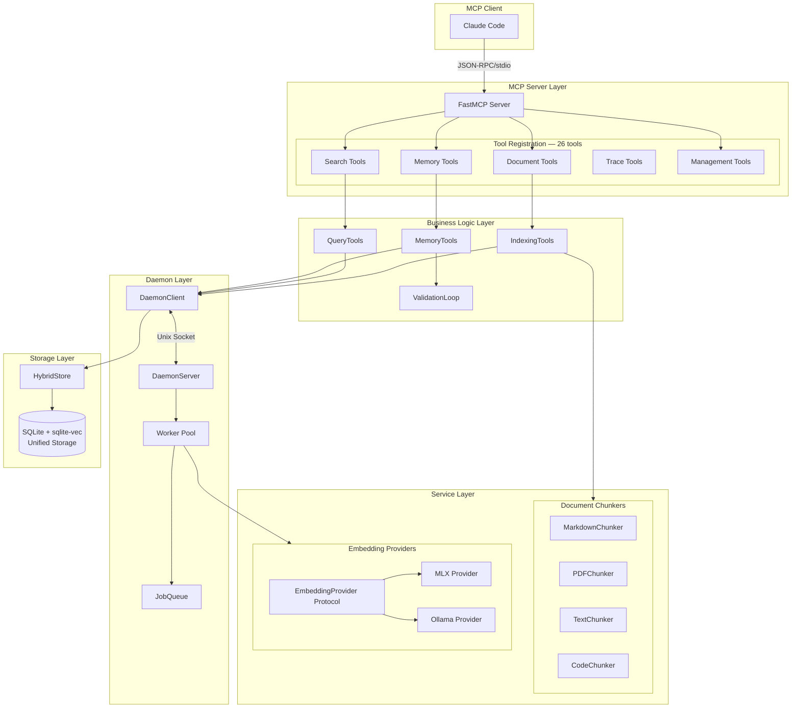

# Architecture Documentation

This document explains the design and architecture of Theo.

## System Overview

Theo is a unified AI memory and document retrieval system that combines:
- **DocVec**: Semantic document indexing and retrieval
- **Recall**: Long-term memory with validation and confidence scoring

Built on three core principles:

1. **Local-first**: All processing happens locally using MLX embeddings (Apple Silicon) or Ollama
2. **Privacy-preserving**: No data sent to external APIs
3. **Token-efficient**: Retrieve only relevant chunks to minimize Claude token usage
4. **Validation-driven**: Memories build confidence through practical use

## High-Level Architecture

```
┌─────────────────────────────────────────────────────────────┐
│                    MCP Client (Claude Code)                  │
└────────────────────────────┬────────────────────────────────┘
                             │
                             │ JSON-RPC over stdio
                             │
┌────────────────────────────▼────────────────────────────────┐
│                      MCP Server Layer                        │
│  ┌───────────────────────────────────────────────────────┐  │
│  │  Tool Registration & Dispatch (FastMCP) — 26 tools    │  │
│  │  ├─ Document Tools: index_file, index_directory       │  │
│  │  ├─ Search Tools: search, search_with_filters, ...    │  │
│  │  ├─ Memory Tools: store, recall, forget, context      │  │
│  │  ├─ TRY/LEARN: memory_apply, memory_outcome           │  │
│  │  ├─ Graph: relate, edge_forget, inspect_graph         │  │
│  │  ├─ Inspection: count, list, namespaces, history, ... │  │
│  │  ├─ Trace Tools: trace_query, trace_list              │  │
│  │  └─ Management: delete_*, clear_index, stats          │  │
│  └───────────────────────────────────────────────────────┘  │
└────────────────────────────┬────────────────────────────────┘
                             │
                             │ Function Calls
                             │
┌────────────────────────────▼────────────────────────────────┐
│                    Business Logic Layer                      │
│  ┌─────────────────┐  ┌───────────────┐  ┌──────────────┐   │
│  │ IndexingTools   │  │  QueryTools   │  │ MemoryTools  │   │
│  │ - File indexing │  │ - Search      │  │ - Store      │   │
│  │ - Dir indexing  │  │ - Filtering   │  │ - Recall     │   │
│  │ - Deduplication │  │ - Budgeting   │  │ - Validate   │   │
│  └────────┬────────┘  └───────┬───────┘  └──────┬───────┘   │
│           │                   │                  │           │
│           │   ┌───────────────┴───────────────┐  │           │
│           │   │       ValidationLoop          │──┘           │
│           │   │  - Confidence scoring         │              │
│           │   │  - Golden rule promotion      │              │
│           │   │  - Feedback tracking          │              │
│           │   └───────────────────────────────┘              │
│           │                                                  │
│  ┌────────▼──────────────────────────────────────────────┐  │
│  │              DaemonClient (IPC Layer)                 │  │
│  │  - Unix socket communication (/tmp/theo.sock)         │  │
│  │  - Non-blocking embedding operations                  │  │
│  │  - Auto-fallback to direct embedding                  │  │
│  └────────┬──────────────────────────────────────────────┘  │
└───────────┼──────────────────────────────────────────────────┘
            │
            │
┌───────────▼──────────────────────────────────────────────────┐
│                     Daemon Layer                              │
│  ┌──────────────┐      ┌─────────────┐     ┌──────────────┐  │
│  │ DaemonServer │◀────▶│   Worker    │────▶│ JobQueue     │  │
│  │ - Socket IPC │      │ - Async ops │     │ - Job state  │  │
│  │ - Commands   │      │ - Batching  │     │ - Status     │  │
│  └──────────────┘      └──────┬──────┘     └──────────────┘  │
└────────────────────────────────┼─────────────────────────────┘
                                 │
┌────────────────────────────────▼─────────────────────────────┐
│                     Service Layer                             │
│                                                               │
│  ┌──────────────────┐        ┌──────────────────────────┐    │
│  │ Document Chunkers│        │   Embedding Providers    │    │
│  │                  │        │                          │    │
│  │  ┌────────────┐  │        │  ┌────────────────────┐  │    │
│  │  │  Markdown  │  │        │  │ EmbeddingProvider  │  │    │
│  │  │  Chunker   │  │        │  │    (Protocol)      │  │    │
│  │  └────────────┘  │        │  └─────────┬──────────┘  │    │
│  │  ┌────────────┐  │        │            │             │    │
│  │  │    PDF     │  │        │  ┌─────────┴─────────┐   │    │
│  │  │  Chunker   │  │        │  │         │         │   │    │
│  │  └────────────┘  │        │  ▼         ▼         │   │    │
│  │  ┌────────────┐  │        │ MLX     Ollama       │   │    │
│  │  │   Text     │  │        │Provider  Provider    │   │    │
│  │  │  Chunker   │  │        │(default) (alt)       │   │    │
│  │  └────────────┘  │        └──────────────────────┘   │    │
│  │  ┌────────────┐  │                                   │    │
│  │  │   Code     │  │        ┌──────────────────────┐   │    │
│  │  │  Chunker   │  │        │     SQLiteStore      │   │    │
│  │  └────────────┘  │        │   - Vector storage   │   │    │
│  │                  │        │   - Similarity search│   │    │
│  │ ChunkerRegistry  │        │   - Metadata filter  │   │    │
│  └──────────────────┘        └──────────────────────┘   │    │
│                                                         │    │
└─────────────────────────────────────────────────────────────┘
```

### Mermaid Diagram



## Component Descriptions

### MCP Server Layer

**Responsibility**: Protocol handling and tool registration

**Implementation**: `src/theo/mcp_server.py`, `src/theo/__main__.py`

The MCP Server implements the Model Context Protocol specification using FastMCP, exposing tools to Claude Code via JSON-RPC over stdio. It handles:

- Tool schema registration
- Input validation and deserialization
- Response serialization
- Error propagation
- Lifecycle management

**Key Design Decisions**:
- Async-first: All handlers use async/await for non-blocking I/O
- Thin layer: Business logic delegated to tool classes
- Schema-driven: Input/output schemas define contracts
- **CRITICAL**: All logging goes to stderr (never stdout) for stdio transport

### Business Logic Layer

#### IndexingTools

**Responsibility**: Document indexing workflow orchestration

**Implementation**: `src/theo/tools/indexing_tools.py`

Coordinates the indexing pipeline:
1. Path validation
2. Format detection by extension
3. Chunker selection from registry
4. Embedding via DaemonClient
5. Storage in SQLiteStore

**Key Design Decisions**:
- Validation-first: Fail fast on invalid inputs
- Structured errors: Return actionable error messages
- Namespace support: Organize documents by scope

#### QueryTools

**Responsibility**: Search and retrieval workflow

**Implementation**: `src/theo/tools/query_tools.py`

Manages semantic search pipeline:
1. Query embedding via DaemonClient
2. Vector search in SQLite
3. Metadata filtering
4. Token budget enforcement
5. Result ranking and formatting

**Key Design Decisions**:
- Token awareness: Always calculate and return token counts
- Flexible filtering: Support complex metadata queries
- Feedback collection: Track search result usage

#### MemoryTools

**Responsibility**: Long-term memory operations

**Implementation**: `src/theo/tools/memory_tools.py`

Manages memory lifecycle:
1. Store memories with deduplication
2. Recall memories with semantic search
3. Validate memories to adjust confidence
4. Forget memories (with golden rule protection)
5. Generate context for LLM injection

**Key Design Decisions**:
- Deduplication: Same content returns existing ID
- Validation loop: Confidence adjusts through use
- Golden rule protection: High-confidence memories protected from deletion

#### ValidationLoop

**Responsibility**: Confidence scoring and golden rule promotion

**Implementation**: `src/theo/validation/loop.py`, `src/theo/validation/golden_rules.py`

Implements the TRY → BREAK → ANALYZE → LEARN cycle:
- Memories start at confidence 0.3
- Helpful usage: confidence += 0.1
- Not helpful: confidence -= 0.15
- At confidence >= 0.9: promoted to golden rule

### Daemon Layer

**Responsibility**: Non-blocking embedding operations

The daemon solves the MCP timeout problem that occurs when blocking on expensive embedding operations. MCP servers use stdio transport where blocking operations cause timeouts.

**CRITICAL: MLX Threading Constraint**

MLX Metal GPU operations are NOT thread-safe. The `embed_batch()` method MUST run on the main thread - never via `asyncio.to_thread()`. Using thread pools causes Metal command buffer race conditions with errors like:
```
-[_MTLCommandBuffer addCompletedHandler:]:976: failed assertion
```

The daemon's embed_worker is designed to briefly block the event loop (~50-100ms per batch) rather than use thread pools. This is the only reliable approach without process isolation. Additionally, never call `mx.clear_cache()` during embedding operations.

#### DaemonServer

**Implementation**: `src/theo/daemon/server.py`

Unix socket server at `/tmp/theo.sock`:
- Handles embed, search, status, ping commands
- Routes requests to worker pool
- JSON-RPC protocol over Unix socket

#### DaemonClient

**Implementation**: `src/theo/daemon/client.py`

Client with intelligent fallback:
- Connects to daemon if running
- Falls back to direct embedding if not
- Automatic reconnection on disconnect
- Context manager support

#### Worker

**Implementation**: `src/theo/daemon/worker.py`

Background job processor:
- Async embedding execution
- Job queue management
- Status tracking (pending, processing, completed, failed)

### Service Layer

#### Embedding Providers

**Responsibility**: Pluggable embedding generation

**Protocol**: `src/theo/embedding/provider.py`

```python
class EmbeddingProvider(Protocol):
    def embed(self, text: str, is_query: bool = False) -> list[float]:
        """Generate embedding for single text."""

    def embed_batch(self, texts: list[str]) -> list[list[float]]:
        """Generate embeddings for multiple texts."""
```

#### MLX Provider (Default)

**Implementation**: `src/theo/embedding/mlx_provider.py`

- Native Apple Silicon GPU acceleration via Metal
- Uses mlx-embeddings library
- Model: mxbai-embed-large-v1 (default)
- No external server required

**Thread Safety**: MLX Metal is NOT thread-safe. All MLX operations must run on the main thread. The `embed_batch()` method runs synchronously by design - do NOT use `asyncio.to_thread()`. Never call `mx.clear_cache()` during embedding operations.

#### Ollama Provider (Alternative)

**Implementation**: `src/theo/embedding/ollama_provider.py`

- HTTP client for Ollama API
- Batch embedding support
- Exponential backoff retry
- Configurable timeout

#### HybridStore

**Responsibility**: High-level storage coordination

**Implementation**: `src/theo/storage/hybrid.py`

The HybridStore provides a high-level interface to SQLiteStore, handling:
- Document and memory storage with embeddings
- Graph expansion during queries
- Validation event tracking

```python
class HybridStore:
    """Coordinated storage layer."""
    store: SQLiteStore      # Unified vector + metadata storage

    def store_with_edges(self, doc, edges): ...
    def query_with_graph_expansion(self, query, depth): ...
```

#### SQLiteStore

**Responsibility**: Unified vector and metadata storage using sqlite-vec

**Implementation**: `src/theo/storage/sqlite_store.py`

Features:
- Vector similarity search via sqlite-vec extension
- Full-text search via FTS5
- Metadata filtering (WHERE clauses)
- Deduplication tracking (by content hash)
- Edge storage (source_id, target_id, relation_type, weight)
- Graph traversal queries (BFS, path finding)
- Validation event history
- Embedding cache for efficiency

### Document Chunkers

**Responsibility**: Format-specific content segmentation

**Registry**: `src/theo/chunking/registry.py`

All chunkers implement `AbstractChunker` interface:

```python
class AbstractChunker(ABC):
    @abstractmethod
    def chunk(self, content: str, source_file: str) -> list[Chunk]:
        """Split content into semantically meaningful chunks."""
```

| Chunker | File Types | Strategy |
|---------|-----------|----------|
| MarkdownChunker | .md, .markdown | Header-aware hierarchical chunking |
| PDFChunker | .pdf | Page-aware with content continuity |
| TextChunker | .txt | Paragraph-first with sentence fallback |
| CodeChunker | .py | AST-based semantic chunking |

## Unified Data Model

### MemoryDocument

**Implementation**: `src/theo/types/memory.py`

The key insight: Document chunks and memories are both "remembered information" that can be stored, retrieved, and validated.

```python
class MemoryDocument:
    # Core fields
    id: str
    content: str
    content_hash: Optional[str]
    memory_type: MemoryType
    namespace: str

    # Provenance fields (from DocVec Chunk)
    source_file: Optional[str]
    chunk_index: int
    start_line: Optional[int]
    end_line: Optional[int]

    # Context fields (from Recall Memory)
    importance: float  # 0.0-1.0
    confidence: float  # 0.0-1.0, increases through validation
    created_at: datetime
    accessed_at: datetime
    access_count: int

    # Relationships for memory graph
    relationships: list[Relationship]
```

### Memory Types

```python
class MemoryType(str, Enum):
    DOCUMENT = "document"      # Document chunk from file indexing
    PREFERENCE = "preference"   # User preferences or settings
    DECISION = "decision"       # Design or implementation decisions
    PATTERN = "pattern"         # Recognized patterns or recurring behaviors
    SESSION = "session"         # Session-related information
    FILE_CONTEXT = "file_context"  # File activity tracking
    GOLDEN_RULE = "golden_rule"    # High-confidence constitutional principles
    FACT = "fact"               # Factual information
```

### Relationship Types

```python
class RelationType(str, Enum):
    RELATES_TO = "relates_to"   # General relationship
    SUPERSEDES = "supersedes"   # One memory replaces another
    CAUSED_BY = "caused_by"     # Causal relationship
    CONTRADICTS = "contradicts" # Conflicting information
```

## Data Flows

### Document Indexing Flow

```
┌──────────┐
│ User     │ index_file("/docs/readme.md", namespace="docs")
└────┬─────┘
     │
     ▼
┌────────────────┐
│ IndexingTools  │ ─── Validate path, detect format
└────┬───────────┘
     │
     ▼
┌──────────────────┐
│ ChunkerRegistry  │ ─── Select chunker by extension
└────┬─────────────┘
     │
     ▼
┌──────────────────┐
│ MarkdownChunker  │ ─── Parse headers, split into chunks
└────┬─────────────┘     ─── Add header_path metadata
     │
     ▼
┌──────────────────┐
│ DaemonClient     │ ─── Request embeddings
└────┬─────────────┘     ─── (async via Unix socket)
     │
     ▼
┌──────────────────┐
│ Embedding        │ ─── Generate embeddings
│ Provider         │     ─── Batch processing
└────┬─────────────┘
     │
     ▼
┌──────────────────┐
│ SQLiteStore      │ ─── Store embeddings + metadata
└────┬─────────────┘     ─── Track doc_hash for dedup
     │
     ▼
┌──────────────────┐
│ Response         │ ─── {chunks_created: 12, chunk_ids: [...]}
└──────────────────┘
```

### Memory Validation Flow

```
┌──────────┐
│ Recall   │ memory_recall(query="coding patterns")
│ Memory   │ → Returns memory with id="mem_123"
└────┬─────┘
     │
     │ Memory is used in conversation
     ▼
┌──────────┐
│ Validate │ memory_validate(id="mem_123", was_helpful=True)
└────┬─────┘
     │
     ▼
┌──────────────────┐
│ ValidationLoop   │ ─── Calculate new confidence
└────┬─────────────┘     ─── old: 0.7 → new: 0.8
     │
     │ If confidence >= 0.9:
     ▼
┌──────────────────┐
│ GoldenRules      │ ─── Promote to golden rule
└────┬─────────────┘     ─── Update memory_type
     │
     ▼
┌──────────────────┐
│ Response         │ ─── {old_confidence: 0.7, new_confidence: 0.8, promoted: false}
└──────────────────┘
```

## Design Decisions and Rationale

### Why Local Embeddings (MLX/Ollama)?

**Decision**: Use local embedding generation with MLX (default) or Ollama (alternative)

**Rationale**:
- **Privacy**: Documents never leave local machine
- **Cost**: No API fees for embedding generation
- **Latency**: Faster for small batches (no network round trip)
- **Control**: Model selection and version control

### Why a Daemon for Embeddings?

**Decision**: Use Unix socket daemon for embedding operations

**Rationale**:
- **MCP Timeout Problem**: stdio-based MCP servers block on I/O, expensive operations cause timeouts
- **Non-blocking**: Daemon handles embeddings asynchronously (<10ms IPC overhead)
- **Resource Efficiency**: Share embedding model across requests
- **Graceful Fallback**: Auto-fallback to direct embedding if daemon unavailable

### Why Unified MemoryDocument Type?

**Decision**: Single type for both document chunks and memories

**Rationale**:
- **Conceptual Unity**: Both are "remembered information" with semantic search
- **Shared Features**: Both benefit from confidence scoring, relationships, metadata
- **Simpler Storage**: Single SQLite collection, unified query interface
- **Cross-pollination**: Documents can inform memories and vice versa

### Why Validation Loop for Memories?

**Decision**: Implement confidence scoring through practical use

**Rationale**:
- **Self-healing**: Bad memories lose confidence and fade
- **Trust building**: Frequently helpful memories become golden rules
- **Explicit feedback**: User can validate/invalidate memories
- **Constitutional AI**: Golden rules inform future interactions

## Error Handling Philosophy

### Fail Fast for User Errors

Invalid inputs (bad paths, malformed queries) return immediately with clear error messages:
```python
{"success": False, "error": "File not found: /path/to/missing.md"}
```

### Retry for Transient Failures

Network errors, temporary daemon unavailability use exponential backoff in the client.

### Graceful Degradation

Daemon unavailable → DaemonClient falls back to direct embedding
Golden rule deletion attempt → Returns protected_ids without deleting

### Structured Error Responses

All tools return consistent format:
```python
{
    "success": bool,
    "data": dict | None,
    "error": str | None
}
```

## Performance Characteristics

### Embedding Performance

| Backend | Platform | Performance |
|---------|----------|-------------|
| MLX | Apple Silicon M1/M2/M3 | ~100-300 chunks/second |
| Ollama (CPU) | Any | ~50-100 chunks/second |
| Ollama (GPU) | NVIDIA/AMD | ~200-500 chunks/second |

### Query Performance

| Database Size | Search Latency |
|--------------|----------------|
| 1,000 chunks | <100ms |
| 10,000 chunks | <200ms |
| 100,000 chunks | <500ms |

### Daemon IPC Overhead

- Unix socket round-trip: <10ms
- Amortized over embedding batches: negligible

## Scalability Considerations

### Current Limitations

1. **Single-machine**: SQLite is not distributed
2. **Memory-bound**: Large batches limited by RAM
3. **Local embedding**: No GPU scaling across machines

### Scaling Strategies

For larger deployments:
1. **Shard by namespace**: Separate SQLite instances per project
2. **Background indexing**: Queue large directories for async processing
3. **Embedding service**: Replace daemon with dedicated embedding API

## Testing Strategy

### Unit Tests

Each component tested in isolation with mocked dependencies:
- `tests/unit/test_chunking/` - Chunker tests
- `tests/unit/test_tools/` - Tool logic tests
- `tests/unit/test_validation/` - Validation loop tests

### Integration Tests

Full pipeline tests with real components:
- `tests/integration/test_full_pipeline.py` - End-to-end indexing + search
- `tests/integration/test_daemon_integration.py` - Client-server IPC
- `tests/integration/test_mcp_tools.py` - MCP tool handlers

### Mock Strategy

Tests use fixtures for isolation:
- `mock_embedder`: Returns deterministic embeddings without MLX/Ollama
- `temp_sqlite`: Temporary SQLite database for isolated tests
- `tmp_path`: Temporary directories for file operations
